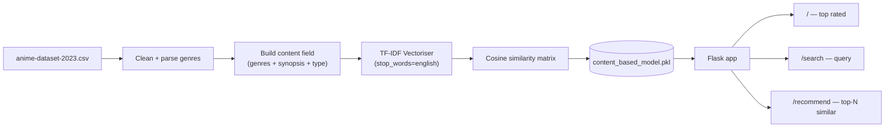

# AniMate: Content-Based Anime Recommendation System

> A content-based recommender that suggests anime from ~25k titles using **TF-IDF vectorisation** and **cosine similarity**, served through a small **Flask** web app.


AniMate recommends titles that are *similar in content* to one you already like. Each anime is turned into a single text document (genres + synopsis + type), vectorised with TF-IDF, and compared to every other title by cosine similarity. The top‑N most similar titles are returned. The trained similarity model is cached with `pickle` so the app starts instantly after the first run.

---

## Demo

A screen recording is included in the repo: [`video3192746571.mp4`](video3192746571.mp4).

---

## Features

- 🔎 **Search** anime by name, genre, or words in the synopsis
- 🎯 **Content-based recommendations**: "more like this" for any title
- ⭐ **Top‑rated** landing page sorted by score
- ⚡ **Cached model**: TF-IDF matrix + similarity persisted with `pickle` for fast restarts
- 🖼️ **Poster images** with graceful fallback to a placeholder

---

## How It Works



The recommendation core (`app.py`):

```python
tfidf = TfidfVectorizer(stop_words='english', max_df=0.8, min_df=5)
tfidf_matrix = tfidf.fit_transform(anime['content'])
cosine_sim = cosine_similarity(tfidf_matrix, tfidf_matrix)
```

---

## Tech Stack

| Layer | Tools |
|------|-------|
| ML / data | scikit-learn (`TfidfVectorizer`, `cosine_similarity`), pandas, numpy |
| Web | Flask, Jinja2, Bootstrap 4 |
| Assets | `requests` + `tqdm` for bulk poster downloads |

---

## Getting Started

**Prerequisites:** Python 3.9+

**1. Install dependencies**
```bash
pip install -r requirements.txt
```

**2. Get the dataset** (not committed — it's large)

Download the [MyAnimeList dataset](https://www.kaggle.com/datasets/dbdmobile/myanimelist-dataset?select=anime-dataset-2023.csv) from Kaggle and place `anime-dataset-2023.csv` in `data/`.

**3. (Optional) Download poster images**
```bash
python images.py        # caches posters into static/images/anime/
```

**4. Run the app**
```bash
flask run
# or: python app.py
```
Open http://127.0.0.1:5000 
The similarity model is built and cached on first launch.

---

## Project Structure

```
app.py                 Flask app: routes + TF-IDF/cosine recommendation engine
images.py              Bulk-downloads poster images for the catalogue
templates/
  index.html           Home + search results
  recommendations.html "More like this" page
static/placeholder/    Fallback poster
data/                  (you add) anime-dataset-2023.csv
models/                (generated) content_based_model.pkl
```

---

## Notes & Possible Extensions

- The catalogue and the pickled model are intentionally **not committed** (size); they're regenerated from the Kaggle CSV.
- Natural next steps: hybrid filtering (content + collaborative), approximate nearest neighbours (FAISS) to scale similarity lookups, and an autocomplete search box.

---

## Author

**Muhammad Wajih Hyder** — BS Computer Science, FAST‑NUCES (2026)
[GitHub @wajihhyder](https://github.com/wajihhyder) · wajihhyder22@gmail.com
